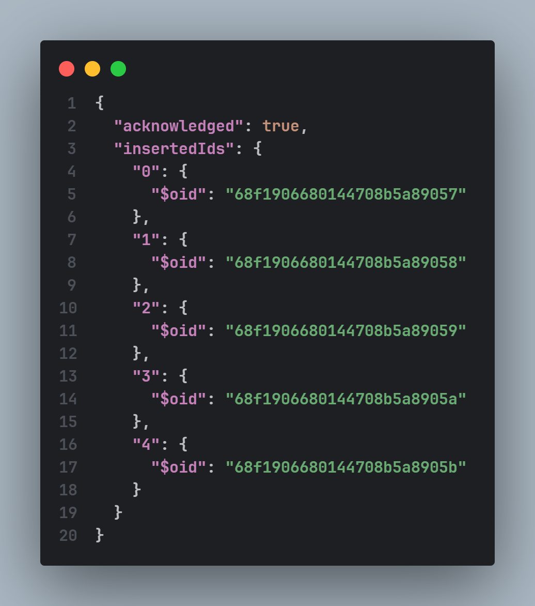

# Exercicio MongoDB

### criar tabelas e inserir dados

#### Atividade - 1

1. Inserir todos os registros na collection alienigenas_turistas.

2. Consultar alienígenas que estão visitando Marte.

3. Mostrar nomes e planetas dos que estão Animados.

4. Procurar os alienígenas com gasto_medio acima de 200.

5. Atualizar Bliptor para humor 'Empolgado'.

6. Aumentar gasto_medio de T’quinn para 400.

7. Atualizar numero_de_tentaculos de Moolah para 4

8. Exibir alienígenas com 4 ou mais tentáculos

9. Mostrar quem tem o maior gasto_medio.

10. Ordenar registros por destino em ordem alfabética.

#### Atividade 2 - naves_exploradoras

11. Inserir registros na collection.

12. Consultar naves em missão.

13. Mostrar nomes e destinos com autonomia > 100.

14. Atualizar Eclipse Rubro para status 'Resgatada'.

15. Aumentar autonomia da Aurora Nebulosa para 120

16. Ordenar naves por tripulantes (decrescente)

17. Inserir registros.

18. Listar robôs ativos

19. Exibir código e bateria com amostras > 40.

20. Atualizar ZY-22 para 'Ativo'.

21. Recarregar ALN-7 (bateria 100)

22. Ordenar por amostras_coletadas (decrescente).

